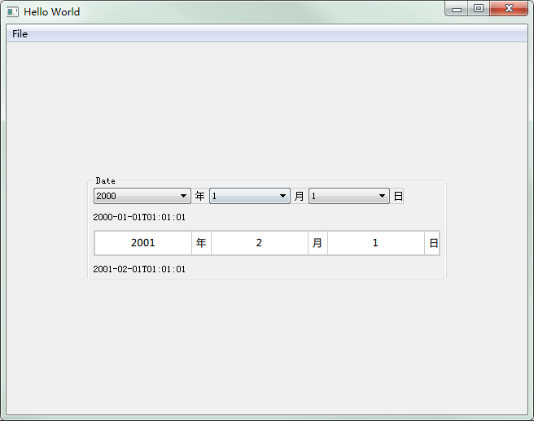
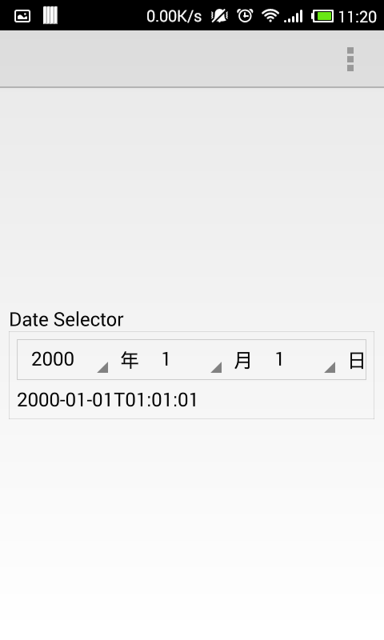
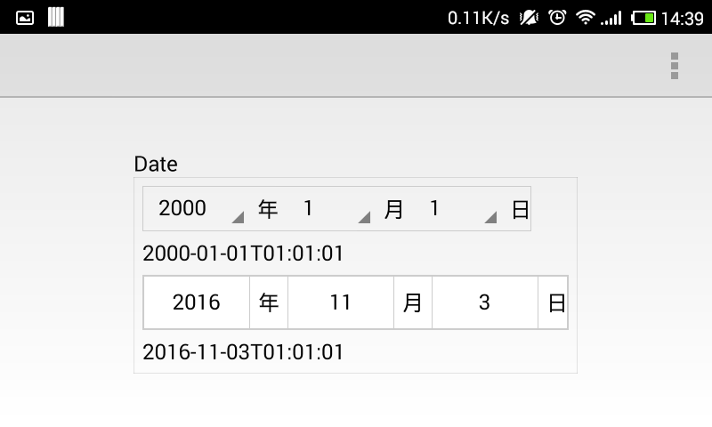

# DateSelector

`DateSelector` and `DateTumbler`.

---

win7



---

Android 4





## How to uss

```qml
DateSelector{
    startYear: 2000    // set the start year
    endYear: 2016      // set the end year
    onDateChanged:{
        console.log(date);
    }
}
```

```qml
DateTumbler{
    startYear: 2000    // set the start year
    endYear: 2016      // set the end year
    onDateChanged:{
        console.log(date);
    }
}
```

### property 

*date* **date** read only

The **date** property hold that what date you select from the DateSelector. It's a JS's Date object.
